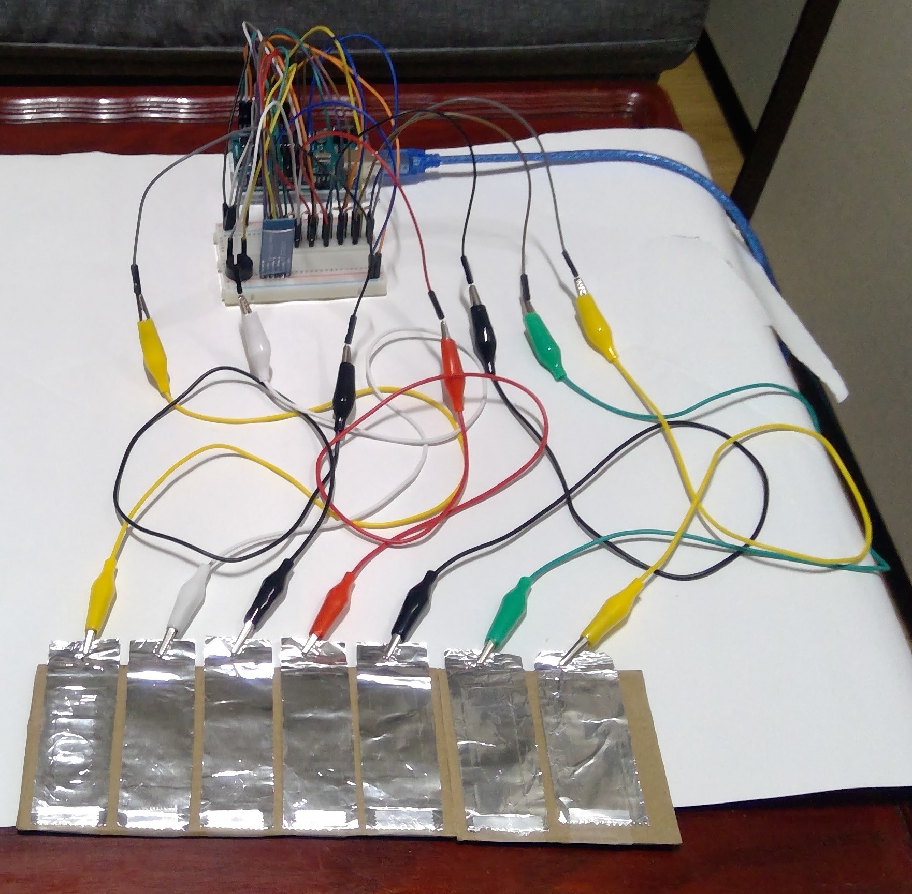

# 터치센서 기반의 아두이노 피아노

## 프로젝트 소개
- 아두이노(Arduino)를 통해 터치센서 기반으로 동작하는 피아노를 구현한다.
- 안드로이드 어플을 통해 피아노와 통신한다.

## 프로젝트 목표
- 흔한 전도체인 은박지를 사용하여 피아노를 구현한다.
- 안드로이드 어플을 통해 녹음 및 재생 기능을 구현한다.

## 피아노 구현 사진

## 시연 영상
- (readme 폴더의 show_1~4.mp4 파일 참고)

<iframe width="560" height="315"
src="https://www.youtube.com/embed/MUQfKFzIOeU"
frameborder="0"
allow="accelerometer; autoplay; encrypted-media; gyroscope; picture-in-picture"
allowfullscreen></iframe>





## 발생 문제
- 노트북 충전기가 연결된 상태에서만 피에조 부저가 울리는 현상.
- 피아노와 안드로이드 어플 간의 블루투스 통신 시, 한 글자씩만 전송 가능한 현상.

## 참고자료
- https://kocoafab.cc/tutorial/view/473
- https://kocoafab.cc/tutorial/view/712
- https://kocoafab.cc/tutorial/view/758
- https://blog.codejun.space/13
